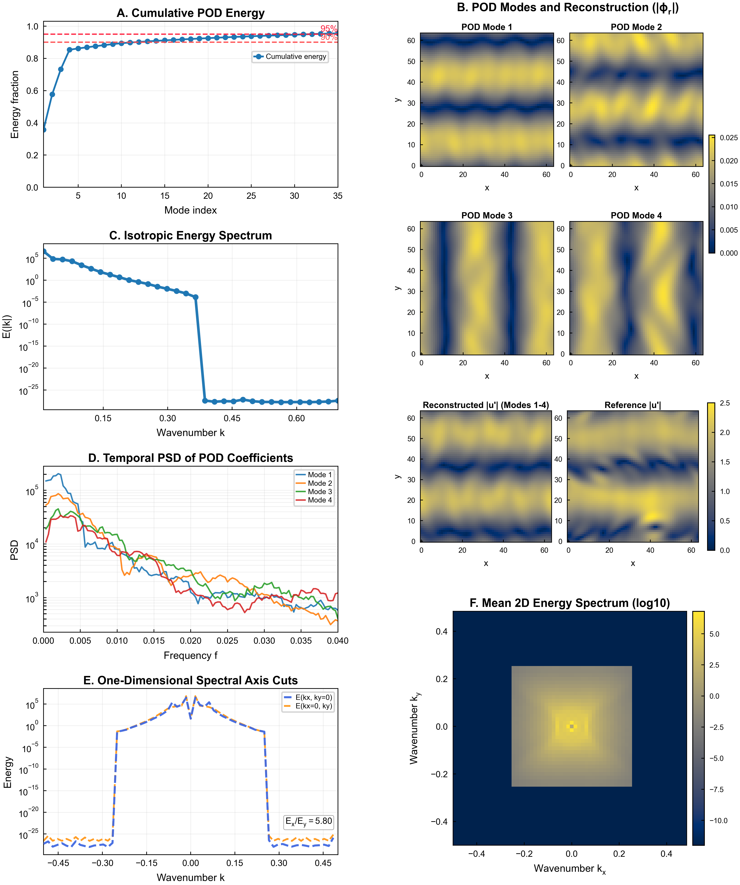

# ME5311 Project 1 

This project is a compact Python workflow for vector-field analysis, covering POD, spatial spectrum analysis, temporal PSD analysis, and publication-style figure export. I built an end-to-end and reproducible pipeline from raw snapshots to final outputs, including data loading with validation and subsampling, mean/fluctuation decomposition, POD via SVD, low-order reconstruction checks, isotropic and 2D spectral analysis, dominant-frequency extraction, anisotropy quantification, and automatic export of key metrics.

The main results show that dominant structures are captured efficiently by POD, with 90% and 95% cumulative energy reached at modes 12 and 32, and a 4-mode reconstruction relative error of 0.2832. The spatial spectrum indicates a clear dominant scale at |k*| = 0.0625 with characteristic wavelength 16, segment-based spectral peaks remain stable, anisotropy is pronounced with Ex/Ey = 5.79983, and leading modal dynamics are concentrated in low frequencies around 3.33e-4 to 2.67e-3.



## Project Files
- `main.py`: full analysis pipeline entry point
- `config.py`: paths and analysis parameters
- `load_data.py`: data loading and frame indexing
- `analysis.py`: POD, spectra, PSD, and metrics functions
- `plot.py`: consolidated publication-style figure generation
- `data/vector_64.npy`: input dataset (not included — see `data/placeholder.txt`)

## Requirements
Install dependencies:

```bash
pip install -r requirements.txt
```

## Run
From the project root:

```bash
python main.py
```

## Outputs
- Figure: `outputs/q1_q4_summary_B.png`
- Text summary: `outputs/analysis_summary.txt`
